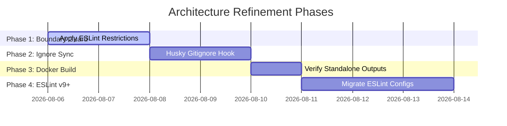

# Architecture Optimization & Debloat Roadmap

This roadmap lists tasks to address the architectural opportunities identified during the workspace cleanup.

---

## 📅 Roadmap Tasks & Action Plan

### 1. Phase 1: Enforce Client/Server Import Boundaries

- **Context:** Prevent React Client Components from importing backend packages like `@repo/redis` or `@repo/database` directly, which forces Node-native imports (`ioredis`, `pg`, `tls`) into browser bundles and breaks compilation.
- **Plan:**
  - Edit [`apps/portal/.eslintrc.cjs`](file:///home/timothy/Documents/Arch-System/apps/portal/.eslintrc.cjs#L76-L94) to add restricted imports for `@repo/redis` and `@repo/database` inside frontend directories.
  - Allow specific safe imports (such as types or client-safe proxy classes) while blocking root imports.
- **Verification:** Run `pnpm --filter portal lint` to ensure no active frontend component violates the new boundaries.

### 2. Phase 2: Automate Ignore Syncing (`.gitignore` & `.claudeignore`)

- **Context:** Keep assistant index files clean and prevent heavy local caches (like `.kilo` or `.turbo`) from bloating AI token context.
- **Plan:**
  - Create a sync check script in [`tools/check-ignore-sync.mjs`](file:///home/timothy/Documents/Arch-System/tools/check-ignore-sync.mjs) that asserts `.claudeignore` contains all rule keys from `.gitignore`.
  - Add this script to the git pre-commit stage via [`lint-staged.config.mjs`](file:///home/timothy/Documents/Arch-System/lint-staged.config.mjs).
- **Verification:** Verify hook execution by modifying `.gitignore` and checking if commit triggers a warning if `.claudeignore` is out of sync.

### 3. Phase 3: Optimize Docker Layer Cache with Turbo Prune

- **Context:** The current portal build utilizes `turbo prune --scope=portal --docker` in Stage 1 but copies the lockfile directly.
- **Plan:**
  - Review the [`apps/portal/Dockerfile`](file:///home/timothy/Documents/Arch-System/apps/portal/Dockerfile) execution paths.
  - Ensure Turborepo remote caching variables (`TURBO_TEAM` / `TURBO_TOKEN`) are configured to leverage layer caches and standalone build outputs.
- **Verification:** Build container locally using `docker build -t portal -f apps/portal/Dockerfile .`.

### 4. Phase 4: Migrate to ESLint Flat Configurations (ESLint v9+)

- **Context:** Clean up root-level deprecated configurations (`.eslintignore` and `.eslintrc.cjs` style configurations) to standard modern setups.
- **Plan:**
  - Consolidate all ignore keys from `.eslintignore` into the flat configuration setup in packages.
  - Rename configuration files to `eslint.config.mjs` and use flat configuration formats.
- **Verification:** Verify by running `pnpm eslint` to ensure linter execution passes cleanly without legacy configuration warnings.
