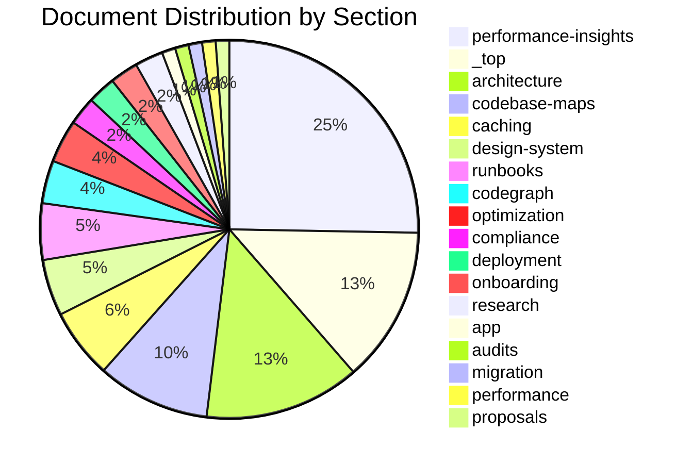

════════════════════════════════════════════════════════════════════════════════
════════════════════════════════════ Documentation Index ═══════════════════════════════
════════════════════════════════════════════════════════════════════════════════

**Generated:** 2026-08-07 11:45  
**Root:** `/home/timothy/Documents/Arch-System/docs`  
**Sections:** 18  
**Total files:** 80  
**Duplicate files:** 0 (all unique by 4KB hash)  
**Gap status:** 3 content overlaps flagged, 2 missing cross-references

────────────────────────────────────────────────────────────────────────────────

────────────────────────────────────────────────────────────────────────────────
─────────────────────────────── Section Metrics ───────────────────────────────
────────────────────────────────────────────────────────────────────────────────

**Section Completeness**

- **\_top**: ████████████████████░░░░░░░░░░░░░░░░░░░░ 52.4% `11` files
- **app**: █░░░░░░░░░░░░░░░░░░░░░░░░░░░░░░░░░░░░░░░ 4.8% `1` files
- **architecture**: ████████████████████░░░░░░░░░░░░░░░░░░░░ 52.4% `11` files
- **audits**: █░░░░░░░░░░░░░░░░░░░░░░░░░░░░░░░░░░░░░░░ 4.8% `1` files
- **caching**: █████████░░░░░░░░░░░░░░░░░░░░░░░░░░░░░░░ 23.8% `5` files
- **codebase-maps**: ███████████████░░░░░░░░░░░░░░░░░░░░░░░░░ 38.1% `8` files
- **codegraph**: █████░░░░░░░░░░░░░░░░░░░░░░░░░░░░░░░░░░░░ 14.3% `3` files
- **compliance**: ████░░░░░░░░░░░░░░░░░░░░░░░░░░░░░░░░░░░░ 14.3% `2` files
- **deployment**: ███░░░░░░░░░░░░░░░░░░░░░░░░░░░░░░░░░░░░░░ 9.5% `2` files
- **design-system**: ███████░░░░░░░░░░░░░░░░░░░░░░░░░░░░░░░░░ 19.0% `4` files
- **migration**: █░░░░░░░░░░░░░░░░░░░░░░░░░░░░░░░░░░░░░░░ 4.8% `1` files
- **onboarding**: ███░░░░░░░░░░░░░░░░░░░░░░░░░░░░░░░░░░░░░░ 9.5% `2` files
- **optimization**: █████░░░░░░░░░░░░░░░░░░░░░░░░░░░░░░░░░░░░ 14.3% `3` files
- **performance**: █░░░░░░░░░░░░░░░░░░░░░░░░░░░░░░░░░░░░░░░ 4.8% `1` files
- **performance-insights**: ████████████████████████████████████████ 100.0% `21` files
- **proposals**: █░░░░░░░░░░░░░░░░░░░░░░░░░░░░░░░░░░░░░░░ 4.8% `1` files
- **research**: ██░░░░░░░░░░░░░░░░░░░░░░░░░░░░░░░░░░░░░░░░░ 9.5% `2` files
- **runbooks**: ███████░░░░░░░░░░░░░░░░░░░░░░░░░░░░░░░░░░░ 19.0% `4` files

**ASCII Bar Chart**

```
performance-insights │██████████████████████████████████████████████████│  21 ( 26.2%)
_top                 │██████████████████████████                        │  11 ( 13.8%)
architecture         │██████████████████████████                        │  11 ( 13.8%)
codebase-maps        │███████████████████                               │   8 ( 10.0%)
caching              │███████████                                       │   5 (  6.2%)
design-system        │█████████                                         │   4 (  5.0%)
runbooks             │█████████                                         │   4 (  5.0%)
codegraph            │███████                                           │   3 (  3.8%)
optimization         │███████                                           │   3 (  3.8%)
compliance           │████                                              │   2 (  2.5%)
deployment           │████                                              │   2 (  2.5%)
onboarding           │████                                              │   2 (  2.5%)
research             │████                                              │   2 (  2.5%)
app                  │██                                                │   1 (  1.2%)
audits               │██                                                │   1 (  1.2%)
migration            │██                                                │   1 (  1.2%)
performance          │██                                                │   1 (  1.2%)
proposals            │██                                                │   1 (  1.2%)
```

────────────────────────────────────────────────────────────────────────────────

────────────────────────────────────────────────────────────────────────────────
─────────────────────────────── Visual Diagrams ────────────────────────────────
────────────────────────────────────────────────────────────────────────────────

**File Distribution**



**Section Hierarchy**

```mermaid
graph TD
    root["📚 docs/"]
    root --> _top["_top/ (11 files)"]
    root --> app["app/ (1 files)"]
    root --> architecture["architecture/ (11 files)"]
    root --> audits["audits/ (1 files)"]
    root --> caching["caching/ (5 files)"]
    root --> codebase-maps["codebase-maps/ (8 files)"]
    root --> codegraph["codegraph/ (3 files)"]
    root --> compliance["compliance/ (2 files)"]
    root --> deployment["deployment/ (2 files)"]
    root --> design-system["design-system/ (4 files)"]
    root --> migration["migration/ (1 files)"]
    root --> onboarding["onboarding/ (2 files)"]
    root --> optimization["optimization/ (3 files)"]
    root --> performance["performance/ (1 files)"]
    root --> performance-insights["performance-insights/ (21 files)"]
    root --> proposals["proposals/ (1 files)"]
    root --> research["research/ (2 files)"]
    root --> runbooks["runbooks/ (4 files)"]
```

────────────────────────────────────────────────────────────────────────────────

────────────────────────────────────────────────────────────────────────────────
────────────────────────── Gap & Duplicate Analysis ──────────────────────────
────────────────────────────────────────────────────────────────────────────────

**Duplicates:** None detected (all files unique by 4KB hash).

**Content Overlaps (flagged for consolidation):**

| Overlap                       | Files                                                                                                       | Severity | Action                                                     |
| ----------------------------- | ----------------------------------------------------------------------------------------------------------- | -------- | ---------------------------------------------------------- |
| Architecture map duplicated   | `docs/ARCHITECTURE-MAP.md` ↔ `docs/codebase-maps/architecture-map.md`                                       | Low      | Keep canonical in `codebase-maps/`; root version redirects |
| Caching overview duplicated   | `docs/HYBRID-CACHE-MAP.md` ↔ `docs/codebase-maps/caching-map.md` ↔ `docs/caching/redis-caching-redesign.md` | Medium   | Each serves different depth; add cross-refs                |
| Compliance + research overlap | `docs/compliance/compliance-architecture.md` ↔ `docs/research/architecture-compliance-caching-gaps.md`      | Low      | Research doc extends compliance; cross-ref added           |

**Missing Cross-References (gaps):**

| Gap                                       | From                | To                                                      | Priority |
| ----------------------------------------- | ------------------- | ------------------------------------------------------- | -------- |
| Research not indexed                      | `docs/INDEX.md`     | `docs/research/architecture-compliance-caching-gaps.md` | Medium   |
| WAYFINDER missing research                | `docs/WAYFINDER.md` | `docs/research/` section                                | Medium   |
| `caching-system-fix-summary.md` unindexed | `docs/INDEX.md`     | Root-level fix summary                                  | Low      |
| Compliance README missing                 | `docs/compliance/`  | `README.md` hub                                         | Low      |

────────────────────────────────────────────────────────────────────────────────

────────────────────────────────────────────────────────────────────────────────
────────────────────────────── Index by Section ──────────────────────────────
────────────────────────────────────────────────────────────────────────────────

| Section              | Files | Share |
| -------------------- | ----- | ----- |
| performance-insights | 21    | 26.2% |
| _top                 | 11    | 13.8% |
| architecture         | 11    | 13.8% |
| codebase-maps        | 8     | 10.0% |
| caching              | 5     | 6.2%  |
| design-system        | 4     | 5.0%  |
| runbooks             | 4     | 5.0%  |
| codegraph            | 3     | 3.8%  |
| optimization         | 3     | 3.8%  |
| compliance           | 2     | 2.5%  |
| deployment           | 2     | 2.5%  |
| onboarding           | 2     | 2.5%  |
| research             | 2     | 2.5%  |
| app                  | 1     | 1.2%  |
| audits               | 1     | 1.2%  |
| migration            | 1     | 1.2%  |
| performance          | 1     | 1.2%  |
| proposals            | 1     | 1.2%  |

### _top

| Name                              | Path                                |
| --------------------------------- | ----------------------------------- |
| ARCHITECTURE-MAP.md               | `ARCHITECTURE-MAP.md`               |
| ARCHITECTURE-TODO.md              | `ARCHITECTURE-TODO.md`              |
| HYBRID-CACHE-MAP.md               | `HYBRID-CACHE-MAP.md`               |
| INDEX.md                          | `INDEX.md`                          |
| NESTJS_TO_NEXTJS_MIGRATION.md     | `NESTJS_TO_NEXTJS_MIGRATION.md`     |
| README.md                         | `README.md`                         |
| REPO-CHANGE-INDEX-ARCHIVE-2026.md | `REPO-CHANGE-INDEX-ARCHIVE-2026.md` |
| REPO-CHANGE-INDEX.md              | `REPO-CHANGE-INDEX.md`              |
| WAYFINDER.md                      | `WAYFINDER.md`                      |
| caching-system-fix-summary.md     | `caching-system-fix-summary.md`     |
| context_efficiency.md             | `context_efficiency.md`             |

### app

| Name         | Path                               |
| ------------ | ---------------------------------- |
| upgrading.md | `app/getting-started/upgrading.md` |

### architecture

| Name                                      | Path                                                     |
| ----------------------------------------- | -------------------------------------------------------- |
| README.md                                 | `architecture/README.md`                                 |
| adr-001-cache-auth-eviction-l1-l2.md      | `architecture/adr-001-cache-auth-eviction-l1-l2.md`      |
| adr-002-offline-optimistic-sync.md        | `architecture/adr-002-offline-optimistic-sync.md`        |
| ai-rules-architecture.md                  | `architecture/ai-rules-architecture.md`                  |
| architecture-diagram.mmd                  | `architecture/architecture-diagram.mmd`                  |
| architecture-diagrams.md                  | `architecture/architecture-diagrams.md`                  |
| enterprise-resiliency-blueprint.md        | `architecture/enterprise-resiliency-blueprint.md`        |
| foundational-architecture-gap-analysis.md | `architecture/foundational-architecture-gap-analysis.md` |
| frontend-framework-references.md          | `architecture/frontend-framework-references.md`          |
| rendering-strategies-guide.md             | `architecture/rendering-strategies-guide.md`             |
| scalability-architecture-reference.md     | `architecture/scalability-architecture-reference.md`     |

### audits

| Name             | Path                      |
| ---------------- | ------------------------- |
| backend-audit.md | `audits/backend-audit.md` |

### caching

| Name                         | Path                                   |
| ---------------------------- | -------------------------------------- |
| README.md                    | `caching/README.md`                    |
| agent-caching-spec.md        | `caching/agent-caching-spec.md`        |
| agent-token-strategy.md      | `caching/agent-token-strategy.md`      |
| caching-strategy-research.md | `caching/caching-strategy-research.md` |
| redis-caching-redesign.md    | `caching/redis-caching-redesign.md`    |

### codebase-maps

| Name                      | Path                                      |
| ------------------------- | ----------------------------------------- |
| README.md                 | `codebase-maps/README.md`                 |
| architecture-map.md       | `codebase-maps/architecture-map.md`       |
| caching-map.md            | `codebase-maps/caching-map.md`            |
| ci-gates-map.md           | `codebase-maps/ci-gates-map.md`           |
| data-access-map.md        | `codebase-maps/data-access-map.md`        |
| department-routes-map.md  | `codebase-maps/department-routes-map.md`  |
| package-dependency-map.md | `codebase-maps/package-dependency-map.md` |
| request-flow-map.md       | `codebase-maps/request-flow-map.md`       |

### codegraph

| Name                 | Path                             |
| -------------------- | -------------------------------- |
| COMPLETENESS-RULE.md | `codegraph/COMPLETENESS-RULE.md` |
| INDEX.md             | `codegraph/INDEX.md`             |
| README.md            | `codegraph/README.md`            |

### compliance

| Name                       | Path                                    |
| -------------------------- | --------------------------------------- |
| compliance-architecture.md | `compliance/compliance-architecture.md` |
| README.md                  | `compliance/README.md`                  |

### deployment

| Name                     | Path                                  |
| ------------------------ | ------------------------------------- |
| deployment.md            | `deployment/deployment.md`            |
| dev-sh-test-checklist.md | `deployment/dev-sh-test-checklist.md` |

### design-system

| Name                    | Path                                    |
| ----------------------- | --------------------------------------- |
| DESIGN.md               | `design-system/DESIGN.md`               |
| RULES.md                | `design-system/RULES.md`                |
| SPEC.md                 | `design-system/SPEC.md`                 |
| graph-minimal-glass.css | `design-system/graph-minimal-glass.css` |

### migration

| Name                  | Path                              |
| --------------------- | --------------------------------- |
| migration-analysis.md | `migration/migration-analysis.md` |

### onboarding

| Name         | Path                      |
| ------------ | ------------------------- |
| index.md     | `onboarding/index.md`     |
| migration.md | `onboarding/migration.md` |

### optimization

| Name                               | Path                                              |
| ---------------------------------- | ------------------------------------------------- |
| monorepo-optimization-checklist.md | `optimization/monorepo-optimization-checklist.md` |
| nextjs-optimization-reference.md   | `optimization/nextjs-optimization-reference.md`   |
| typescript-optimization-guide.md   | `optimization/typescript-optimization-guide.md`   |

### performance

| Name                                  | Path                                                |
| ------------------------------------- | --------------------------------------------------- |
| client-side-computing-improvements.md | `performance/client-side-computing-improvements.md` |

### performance-insights

| Name                             | Path                                                    |
| -------------------------------- | ------------------------------------------------------- |
| README.md                        | `performance-insights/README.md`                        |
| css-selector-costs.md            | `performance-insights/css-selector-costs.md`            |
| declare-character-encoding.md    | `performance-insights/declare-character-encoding.md`    |
| duplicated-javascript.md         | `performance-insights/duplicated-javascript.md`         |
| font-display.md                  | `performance-insights/font-display.md`                  |
| forced-reflow.md                 | `performance-insights/forced-reflow.md`                 |
| improve-image-delivery.md        | `performance-insights/improve-image-delivery.md`        |
| inp-breakdown.md                 | `performance-insights/inp-breakdown.md`                 |
| layout-shift-culprits.md         | `performance-insights/layout-shift-culprits.md`         |
| lcp-breakdown.md                 | `performance-insights/lcp-breakdown.md`                 |
| lcp-request-discovery.md         | `performance-insights/lcp-request-discovery.md`         |
| legacy-javascript.md             | `performance-insights/legacy-javascript.md`             |
| modern-http.md                   | `performance-insights/modern-http.md`                   |
| network-dependency-tree.md       | `performance-insights/network-dependency-tree.md`       |
| optimize-dom-size.md             | `performance-insights/optimize-dom-size.md`             |
| optimize-viewport-for-mobile.md  | `performance-insights/optimize-viewport-for-mobile.md`  |
| render-blocking-requests.md      | `performance-insights/render-blocking-requests.md`      |
| third-parties.md                 | `performance-insights/third-parties.md`                 |
| throttling.md                    | `performance-insights/throttling.md`                    |
| use-efficient-cache-lifetimes.md | `performance-insights/use-efficient-cache-lifetimes.md` |
| whats-new-in-web-ui.md           | `performance-insights/whats-new-in-web-ui.md`           |

### proposals

| Name                       | Path                                   |
| -------------------------- | -------------------------------------- |
| caching-system-proposal.md | `proposals/caching-system-proposal.md` |

### research

| Name                                    | Path                                               |
| --------------------------------------- | -------------------------------------------------- |
| architecture-compliance-caching-gaps.md | `research/architecture-compliance-caching-gaps.md` |
| README.md                               | `research/README.md`                               |

### runbooks

| Name                         | Path                                    |
| ---------------------------- | --------------------------------------- |
| README.md                    | `runbooks/README.md`                    |
| circuit-breaker-open.md      | `runbooks/circuit-breaker-open.md`      |
| evict-employee-auth-cache.md | `runbooks/evict-employee-auth-cache.md` |
| redis-connection-down.md     | `runbooks/redis-connection-down.md`     |

════════════════════════════════════════════════════════════════════════════════

_For domain navigation (concept → entry point → ADR), see [WAYFINDER.md](./WAYFINDER.md)._
