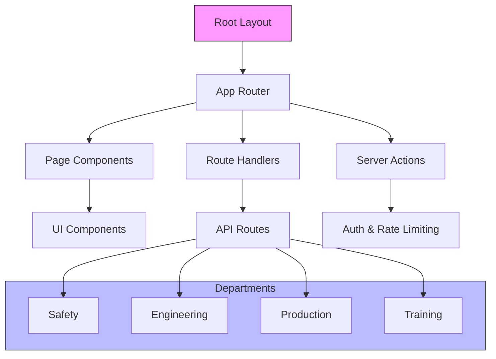

# Architecture Diagrams

## Next.js App Router Structure



## Supabase Integration Patterns

```mermaid
graph TD
  I[Client Components] --> J[createClient()]
  I --> K[Supabase Client]
  J --> L[Browser Access]
  K --> L
  M[Server Components] --> N[createServerSupabaseClient()]
  N --> O[Cookie Sessions]
  O --> P[Server Actions]
  Q[Admin Operations] --> R[createAdminClient()]
  R --> S[Service Role]
  T[Redis Cache] --> U[Rate Limiting]
  T --> V[Telemetry Deduplication]
  T --> W[Health Checks]
  style I fill:#e6f7ff,stroke:#0056b3
  style M fill:#e6f7ff,stroke:#0056b3
  style Q fill:#e6f7ff,stroke:#0056b3
  style T fill:#f0f0f0,stroke:#666
```
