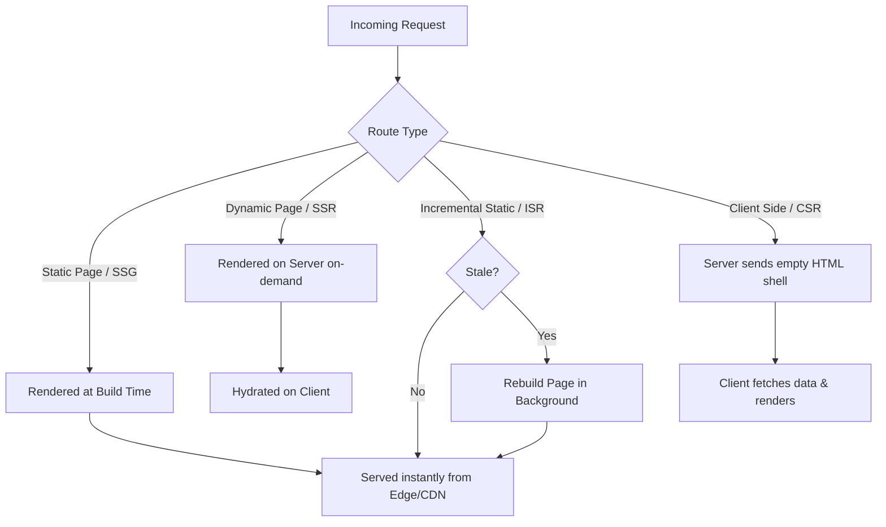

# Next.js Rendering Strategies, Data Fetching, & Architecture Guide

This guide consolidates architectural insights, comparisons, and best practices compiled from modern front-end web architectures, specifically focusing on React.js vs. Next.js, rendering strategies (CSR, SSR, SSG, ISR), state management, and custom server/Docker deployments.

---

## 1. Architectural Foundations: React.js vs. Next.js

Choosing between React.js and Next.js is a fundamental decision of library vs. framework and client-first vs. server-first rendering.

| Architectural Dimension     | React.js (Client-Side Library)                                             | Next.js (Server-First Framework)                                        |
| :-------------------------- | :------------------------------------------------------------------------- | :---------------------------------------------------------------------- |
| **Core Paradigm**           | Single Page Application (SPA) library.                                     | Hybrid React framework for production.                                  |
| **Default Rendering**       | Client-Side Rendering (CSR) via Virtual DOM.                               | Server-Side Rendering (SSR) or Static Site Generation (SSG) by default. |
| **Routing**                 | Client-side only (requires third-party libraries like `react-router-dom`). | Filesystem-based routing (zero configuration).                          |
| **SEO & Indexing**          | Poor out-of-the-box (empty HTML shell with client hydration).              | Excellent (pre-rendered HTML sent to search crawlers).                  |
| **Initial Load Experience** | Can cause a "white screen" effect while downloading JS bundles.            | Instant page shell delivery (prerendered HTML).                         |
| **Data Fetching**           | Client-side fetching via hooks (`useEffect`).                              | Hybrid fetching (CSR, SSR, SSG, ISR, RSC).                              |

---

## 2. Rendering Strategies & Data Fetching

Next.js allows developers to mix and match different rendering strategies on a per-route basis.



### 2.1 Client-Side Rendering (CSR)

- **Mechanism**: The server sends a barebone HTML page containing a `<div id="root">` and script tags. The browser downloads the JS bundle, executes React, constructs the DOM, and fetches data client-side (typically via `useEffect`).
- **Pros**: Native-like app feel, smooth page transitions, lower server-side workload (delegated to browser).
- **Cons**: White screen on initial load, bad for SEO, vulnerable to credential exposure on client-side API requests.

### 2.2 Server-Side Rendering (SSR)

- **Mechanism**: The server generates the complete HTML page with fetched data on every incoming request. The browser receives fully populated markup and hydrates it to make it interactive.
- **Pros**: Instant visible content, secure API calls (secrets stay server-side), bypasses client CORS, excellent SEO.
- **Cons**: Hydration delay (visible but not yet interactive), high server resource load, higher latency (Time to First Byte - TTFB) since rendering blocks the network response.

### 2.3 Static Site Generation (SSG)

- **Mechanism**: The HTML is pre-rendered once at build time. The resulting static files are cached and served from a CDN.
- **Pros**: Ultimate performance (TTFB in milliseconds), zero server runtime overhead, highly scalable and cheap to host.
- **Cons**: Content is static until next deploy, slow build times for sites with millions of pages.

### 2.4 Incremental Static Regeneration (ISR)

- **Mechanism**: Enables static pages to be regenerated in the background at runtime. The developer defines a `revalidate` interval (in seconds). When a request comes in after the interval, the server serves the stale page, triggers a background rebuild, and updates the cache.
- **Pros**: Combines SSG speed with dynamic updates, does not block client requests during regeneration.
- **Cons**: Users may temporarily see stale data; lacks instant purge capabilities without explicit on-demand revalidation.

---

## 3. Core Web Vitals & Performance Impact

The choice of rendering strategy directly impacts Core Web Vitals, which are critical metrics for User Experience and SEO ranking.

- **Largest Contentful Paint (LCP)**: Measures loading performance. It marks the point in the page load timeline when the page's main content has likely loaded.
  - _SSG/ISR/Edge-SSR_: Best LCP ($\le 2.5\text{ s}$).
  - _CSR_: Worst LCP due to sequential JS load, execution, and data-fetching.
- **First Input Delay (FID) / Interaction to Next Paint (INP)**: Measures page interactivity.
  - Heavy server-side HTML can create a large DOM tree, leading to long main-thread blocking during hydration.
  - Progressive hydration and yielding the main thread (`yieldToMain`) keep INP $\le 200\text{ ms}$.
- **Cumulative Layout Shift (CLS)**: Measures visual stability.
  - Adding content dynamically (like images loading without dimensions) shifts layout elements.
  - _Mitigation_: Use Next.js `<Image>` component with defined dimensions or `layout="fill"` to preserve layout slots.

---

## 4. Modern Mapping: Pages Router to App Router (Next.js 16)

Traditional Pages Router concepts (getServerSideProps, getStaticProps) map directly to App Router constructs in Next.js 16:

| Pages Router Concept (Legacy)          | App Router Concept (Next.js 16)                              | Notes                                                        |
| :------------------------------------- | :----------------------------------------------------------- | :----------------------------------------------------------- |
| **`getServerSideProps`**               | Server Components with `cache: 'no-store'` or `connection()` | Dynamic rendering by default when request APIs are read.     |
| **`getStaticProps`**                   | Server Components with default caching or `use cache`        | Page is statically built by default.                         |
| **`getStaticProps` with `revalidate`** | Server Components using `next: { revalidate: X }`            | Incremental Static Regeneration (ISR).                       |
| **`getStaticPaths`**                   | `generateStaticParams()` function                            | Defines static route segments at build time.                 |
| **`next/head` (Head component)**       | Meta metadata export object or `generateMetadata()`          | Built-in, type-safe metadata API.                            |
| **`_app.js` (Custom App)**             | Root `layout.tsx`                                            | Houses global providers, layouts.                            |
| **`_document.js` (Custom Doc)**        | Root `layout.tsx` (html/body tags)                           | Standard HTML5 tags are defined directly in the root layout. |

---

## 5. State Management & API Security

### 5.1 State Management Trade-offs

- **Local State (`useState`)**: Best for component-scoped UI states (modals, inputs, tab toggles).
- **Context API**: Best for medium-scale, mostly static global state (theme, localized auth context). Avoid for high-frequency updates as it triggers re-renders on all consumers.
- **Redux / Zustand**: Best for high-frequency, complex state slices across the application (e.g., e-commerce shopping carts, real-time dashboards).
- **Apollo Client Cache**: Best for GraphQL-heavy applications to maintain a normalized client cache and avoid duplicate fetching.

### 5.2 Securing API Tokens and Environment Variables

- **Security Risk**: Exposing private tokens (like `STRIPE_SECRET_KEY` or custom API tokens) in headers on client-side requests makes them readable in browser DevTools.
- **CORS Blockage**: Browsers enforce Cross-Origin Resource Sharing, preventing client-side scripts from calling external APIs directly if they lack proper headers.
- **Architectural Fix (API Proxying)**:
  - Create an internal Next.js API Route (e.g., `/api/checkout`).
  - The client makes a request to this internal endpoint (bypassing CORS as it's same-origin).
  - The server-side API Handler reads secure environment variables (not prefixed with `NEXT_PUBLIC_`), makes the authorized request to the external service, and returns only the necessary payload back to the client.

```
Client (Browser) -> Internal API Route (/api/checkout) -> External Service (Stripe API with SECRETS)
```

---

## 6. Infrastructure & Deployment

### 6.1 Custom Server (Express / Fastify) vs. Serverless

- **Custom Server**: Required when integrating Next.js into an existing server topology, handling WebSockets natively, or requiring persistent background daemons.
  - _Downside_: Cannot deploy to Vercel's serverless edge. You must manage reverse proxies (Nginx), process managers (PM2), firewall rules, and horizontal scaling.
- **Serverless (Vercel / AWS Lambda)**: The framework splits your routes into isolated serverless functions.
  - _Benefit_: Scaling is handled automatically, pay-per-execution billing model, and built-in edge optimizations.

### 6.2 Dockerization

For on-premise, air-gapped, or custom cloud deployments, containerize Next.js using a multi-stage `Dockerfile`:

```dockerfile
# Stage 1: Install dependencies
FROM node:20-alpine AS deps
WORKDIR /app
COPY package.json pnpm-lock.yaml ./
RUN npm install -g pnpm && pnpm install --frozen-lockfile

# Stage 2: Build the application
FROM node:20-alpine AS builder
WORKDIR /app
COPY --from=deps /app/node_modules ./node_modules
COPY . .
RUN npm install -g pnpm && pnpm run build

# Stage 3: Production runner
FROM node:20-alpine AS runner
WORKDIR /app
ENV NODE_ENV=production
COPY --from=builder /app/public ./public
COPY --from=builder /app/.next/standalone ./
COPY --from=builder /app/.next/static ./.next/static
EXPOSE 3000
CMD ["node", "server.js"]
```

_(Note: Requires `output: 'standalone'` in `next.config.mjs` for minimized Docker image sizes)._
