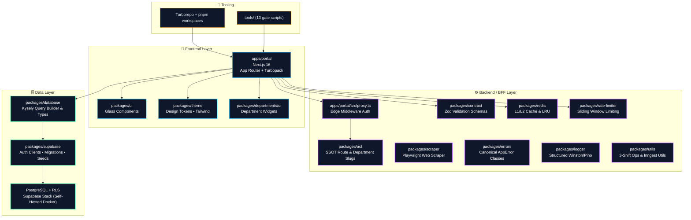
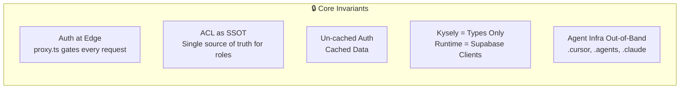
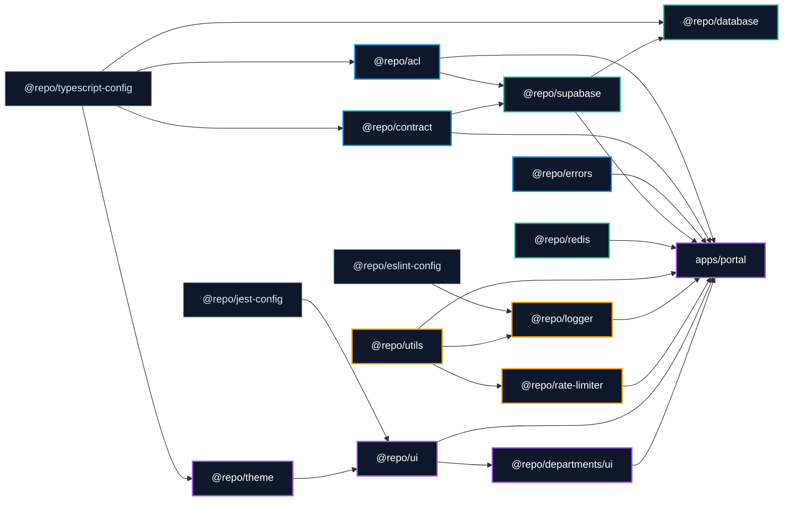

# Architecture Map

Visual layer overview of the Arch-System monorepo. Canonical detailed version:
[`docs/ARCHITECTURE-MAP.md`](../ARCHITECTURE-MAP.md).



## 📋 Architectural Layers

| Layer             | Purpose                                    | Key Packages                                                                                                                                                           |
| ----------------- | ------------------------------------------ | ---------------------------------------------------------------------------------------------------------------------------------------------------------------------- |
| **Frontend**      | UI components, design system, portal app   | `apps/portal`, `packages/ui`, `packages/theme`, `packages/departments/ui`                                                                                              |
| **Backend / BFF** | Auth proxy, validation, caching, utilities | `proxy.ts`, `packages/acl`, `packages/contract`, `packages/redis`, `packages/rate-limiter`, `packages/scraper`, `packages/errors`, `packages/logger`, `packages/utils` |
| **Data**          | Database clients, types, migrations, RLS   | `packages/supabase`, `packages/database`, PostgreSQL + RLS                                                                                                             |

---

## 🔒 Core Invariants



| Invariant                   | Description                                                                               |
| --------------------------- | ----------------------------------------------------------------------------------------- |
| **Auth at Edge**            | `proxy.ts` gates every request via ACL from `@repo/acl` — never redefine ACL logic inline |
| **Kysely = Types Only**     | `@repo/database` generates types only; runtime DB access uses `@repo/supabase` clients    |
| **Agent Infra Out-of-Band** | `.cursor/`, `.agents/`, `.claude/` are never runtime dependencies of product code         |

---

## 🔗 Dependency Order (Build Sequence)



**Canonical Build Order:**

1. **Foundation:** `@repo/typescript-config`, `@repo/eslint-config`, `@repo/jest-config`
2. **Types & Contracts:** `@repo/acl`, `@repo/contract`, `@repo/errors`
3. **Data Layer:** `@repo/supabase`, `@repo/database`, `@repo/redis`
4. **Utilities:** `@repo/utils`, `@repo/logger`, `@repo/rate-limiter`
5. **UI Foundation:** `@repo/theme`, `@repo/ui`, `@repo/departments/ui`
6. **App:** `apps/portal`

---

## ✅ Pre-Merge Quality Gates

```bash
# 1. Type Check and Lint (forced to bypass turbo cache)
pnpm exec turbo run lint type-check test --force

# 2. Full CI Gate Suite (13 checks)
pnpm gates
```

See [`docs/codebase-maps/ci-gates-map.md`](./ci-gates-map.md) for the complete gate visualization.
