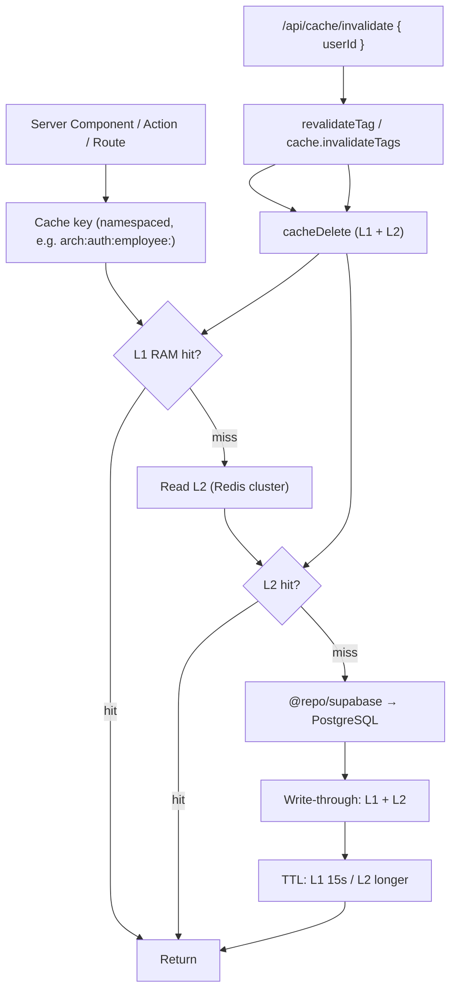

# Caching Map

Redis L1 (RAM) + L2 (cluster) cache flow and invalidation. API:
`packages/redis/src/cache.ts` (`cacheGet`, `cacheSet`, `cacheDelete`).

## Invariants

- **Never cache the auth check** — validate auth in an un-cached outer
  function; only the data fetch is cached.
- **Double-caching avoidance:** when Redis is the primary store, bypass the
  Next.js data cache (`cache: 'no-store'` or `connection()`).
- **Revalidation sync:** any `revalidateTag` must be paired with a
  `cache.invalidateTags` call.
- **Eviction trigger:** on employee role change, the admin `UsersTab`
  role-change flow evicts `arch:auth:employee:<userId>` via
  `POST /api/cache/invalidate`.
