# CI / Gates Map

The 13-check `pnpm gates` suite and the `pnpm quality` pipeline. Source:
root `package.json`.

```mermaid
flowchart TD
    Gates["pnpm gates (13 checks)"] --> G1["lint:markdown (markdownlint)"]
    Gates --> G2["lint:css (stylelint)"]
    Gates --> G3["lint:yaml (tools/lint-yaml.mjs)"]
    Gates --> G4["audit:knip (dead code / unused deps)"]
    Gates --> G5["check:drift (AGENT_TRACER DRIFT SCORE < 0.1)"]
    Gates --> G6["agents:verify (AGENTS.md link sync)"]
    Gates --> G7["design:ratchet (glass pattern baseline)"]
    Gates --> G8["theme:shape (generated.ts token guard)"]
    Gates --> G9["next-backend-guard (proxy.ts, no middleware.ts)"]
    Gates --> G10["performance-budget-guard (server-action bundles)"]
    Gates --> G11["lint:tokens (@repo/theme token integrity)"]
    Gates --> G12["guard:imports (client/server boundary)"]
    Gates --> G13["guard:ignoresync (.gitignore ↔ .claudeignore)"]

    Quality["pnpm quality"] --> Q1["turbo lint + type-check + test (--concurrency=4, --force)"]
    Quality --> Q2["format:check (prettier)"]
    Quality --> Q3["lint:yaml"]
    Quality --> Q4["audit:knip"]
    Quality --> Q5["check:drift"]
    Quality --> Q6["next-backend-guard"]

    PreMerge["Pre-merge checklist"] --> PM1["pnpm exec turbo run lint type-check test --force (0 cached)"]
    PreMerge --> PM2["pnpm gates"]
    PreMerge --> PM3["pnpm format:check"]
    PreMerge --> PM4["bash scripts/smoke-test.sh --strict (optional)"]
```

## Gotchas

- **Turbo caches lint** — always `--force`; a non-forced `pnpm quality` can
  silently pass on stale lint.
- `ci.yml` at the repo root is **stale** (triggers on a removed `redis/`
  module dir); `portal-ci.yml` is the real CI.
- `agents:verify` and `check:drift` run in CI — `DRIFT SCORE` ≥ 0.1 fails the
  pipeline; no score line means "no drift" and passes.
