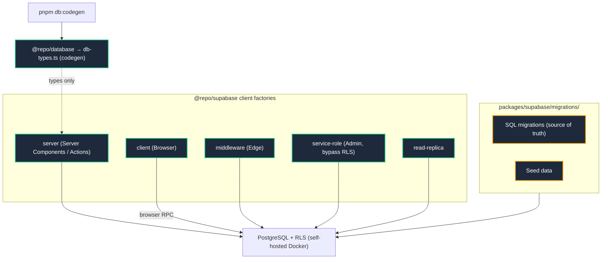

# Data Access Map

How the codebase reaches PostgreSQL. Runtime code uses `@repo/supabase`
clients; `@repo/database` (Kysely) exists for type generation only.

## Rules

- **Never** import `@repo/database` in app runtime code — it is a
  type-generation artifact. Use `@repo/supabase` clients.
- Migrations are the schema source of truth: `pnpx supabase migration new
<name>`, then `pnpm audit:rls` to verify RLS policies.
- Never depend on a remote cloud Supabase link; the stack is local-first
  (`pnpm supabase:start` from `packages/`).
