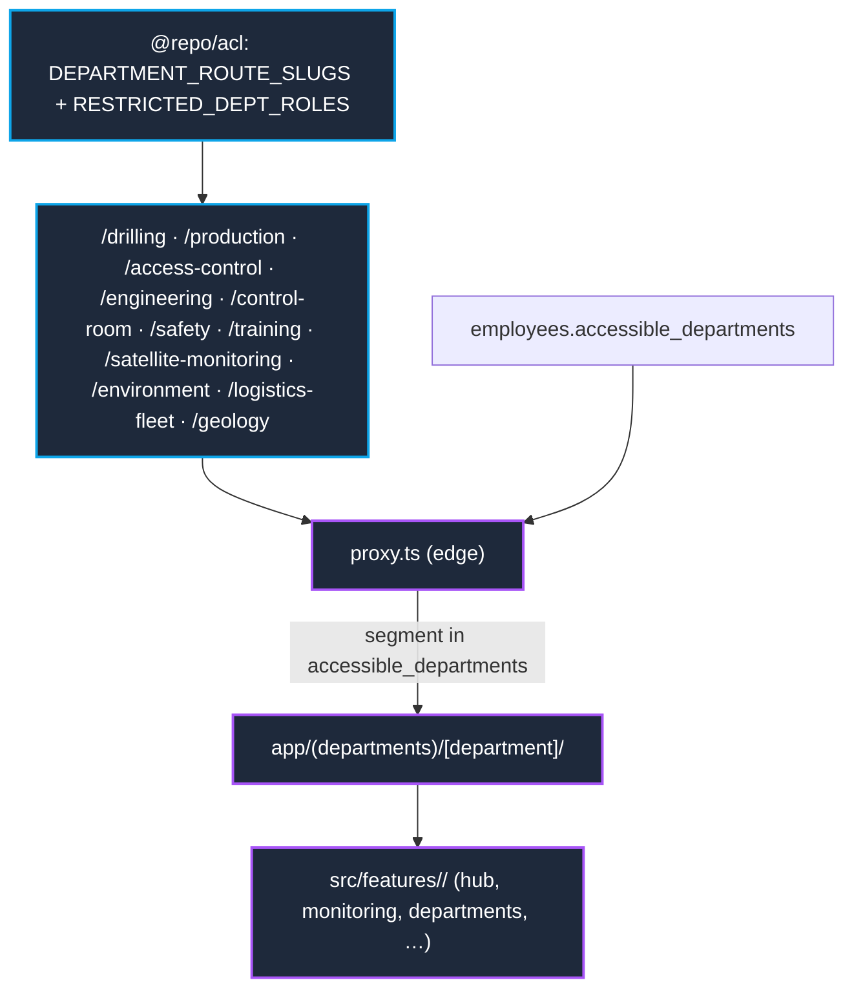

# Department Routes Map

How department slugs become routes and get gated at the edge. SSOT:
`packages/acl/src/index.ts`.

## Rules

- Slugs and restricted roles live only in `@repo/acl`; both `proxy.ts` (edge)
  and `dept-access.ts` (node) import from there — never redefine the ACL
  inline.
- The logged-in employee's `accessible_departments` must include the
  `[department]` segment or the request is redirected / rejected.
- To add a department: add the slug to `DEPARTMENT_ROUTE_SLUGS` (and role to
  `RESTRICTED_DEPT_ROLES`), then build the route group under
  `app/(departments)/[department]/` with a thin wrapper delegating to a
  feature module.
