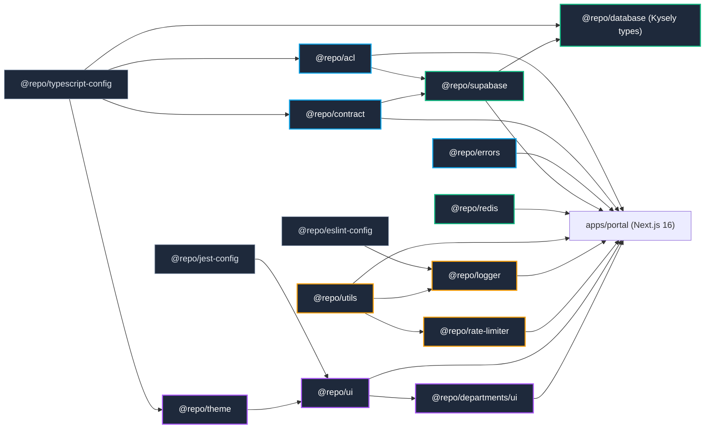

# Package Dependency Map

Build / test dependency order across the monorepo. Test a package only after
its dependencies are built: `pnpm build --filter <dep>` first.

## Canonical order

1. Foundation: `@repo/typescript-config`, `@repo/eslint-config`, `@repo/jest-config`
2. Types & contracts: `@repo/acl`, `@repo/contract`, `@repo/errors`
3. Data layer: `@repo/supabase`, `@repo/database`, `@repo/redis`
4. Utilities: `@repo/utils`, `@repo/logger`, `@repo/rate-limiter`
5. UI foundation: `@repo/theme`, `@repo/ui`, `@repo/departments/ui`
6. App: `apps/portal`

After a package change: `pnpm --filter <package> type-check && pnpm --filter <package> test`, then `pnpm exec turbo run type-check --filter ...^<package>`.
