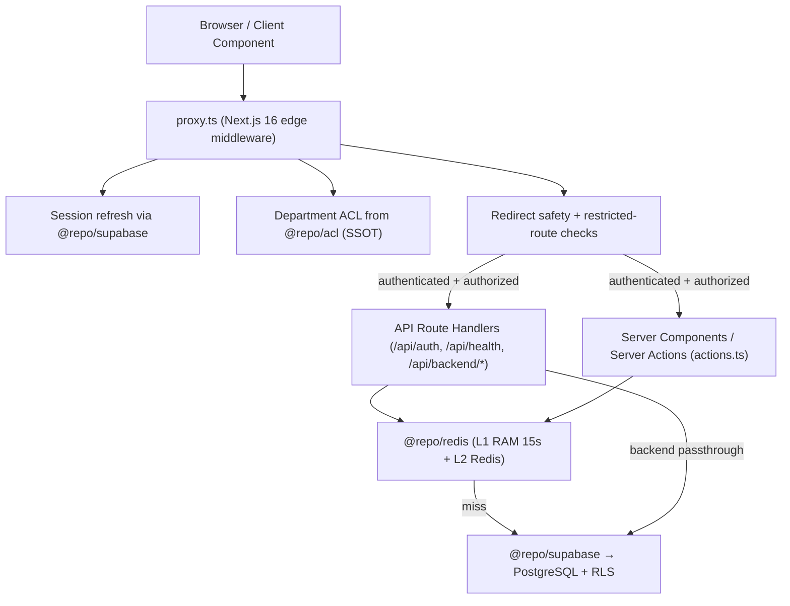

# Request Flow Map

How a browser request travels through the portal. Source of truth:
`apps/portal/src/proxy.ts` + `docs/architecture/enterprise-resiliency-blueprint.md`.

## Invariants

- **Un-cached auth, cached data:** validate auth in an un-cached outer
  function; fetch inside an inner cached function (`createAdminClient()` +
  `cacheTag`). Never read `cookies()`/`headers()` inside `"use cache"` scopes.
- **Backend proxy:** `/api/backend/*` forwards to `API_BASE_URL` (default
  `http://localhost:3004/api`).
- **Double-caching avoidance:** if Redis is the primary store, bypass the
  Next.js data cache with `cache: 'no-store'` or `connection()`.
