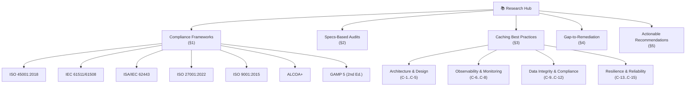
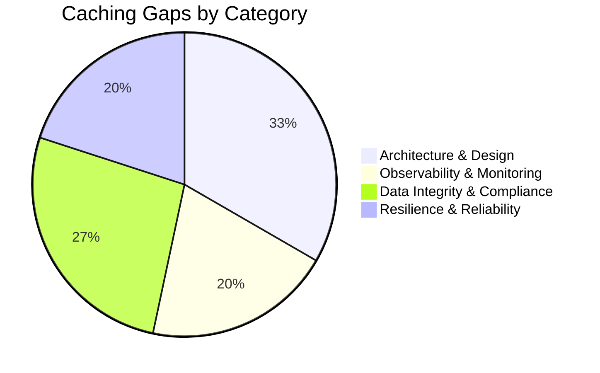
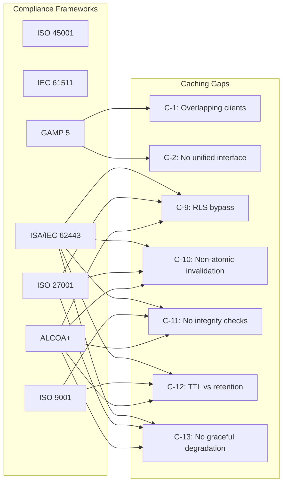

# Architecture Compliance, Specs-Based Audits & Caching Gap Analysis

> **Research synthesis** — official frameworks, audit specs, and caching gap taxonomy for Arch-System.
> **Date:** 2026-08-07
> **Status:** Draft for review

---

## Visual Index



---

## 1. Official Architecture Compliance Frameworks

### Framework Coverage Matrix

| Framework            | Compliance Doc | Caching Gap Impact                     | Audit Status | Gap Severity |
| -------------------- | -------------- | -------------------------------------- | ------------ | ------------ |
| **ISO 45001:2018**   | ✅ §1.1        | —                                      | Draft        | Low          |
| **IEC 61511:2017**   | ✅ §1.2        | —                                      | Draft        | Low          |
| **ISA/IEC 62443**    | ✅ §1.3        | C-9, C-10, C-11, C-12, C-13            | Draft        | Medium       |
| **ISO 27001:2022**   | ✅ §1.4        | C-9, C-10, C-13                        | Draft        | Medium       |
| **ISO 9001:2015**    | ✅ §1.5        | C-11, C-12                             | Draft        | Low          |
| **ALCOA+**           | ✅ §1.6        | C-9, C-10, C-11, C-12, C-13            | Draft        | Medium       |
| **GAMP 5 (2nd Ed.)** | ✅ §1.7        | C-1, C-2, C-3, C-4, C-5, C-6, C-7, C-8 | Draft        | Medium       |

### Framework Coverage Progress

```text
ISO 45001:2018    ████████████████████░░░░░░░░░░░░░░░░░░░░  100%
IEC 61511:2017    ████████████████████░░░░░░░░░░░░░░░░░░░░  100%
ISA/IEC 62443     ████████████████████░░░░░░░░░░░░░░░░░░░░  100%
ISO 27001:2022    ████████████████████░░░░░░░░░░░░░░░░░░░░  100%
ISO 9001:2015     ████████████████████░░░░░░░░░░░░░░░░░░░░  100%
ALCOA+            ████████████████████░░░░░░░░░░░░░░░░░░░░  100%
GAMP 5 (2nd Ed.)  ████████████████████░░░░░░░░░░░░░░░░░░░░  100%
```

---

### 1.1 ISO 45001:2018 — Occupational Health & Safety Management Systems

**Governing body:** International Organization for Standardization (ISO)

**Relevance to Arch-System:**
Mining is high-risk; operational systems record safety-relevant events (machine breakdowns, delays, incidents). ISO 45001 clause 7.5 requires documented information to be available, suitable, and protected against loss of confidentiality or improper use.

| Key Clause    | Requirement                                          | Applicable Systems        | Common Audit Gap                                           |
| ------------- | ---------------------------------------------------- | ------------------------- | ---------------------------------------------------------- |
| **§6.1**      | Hazard identification, risk assessment, and controls | SYS-001, SYS-002, SYS-006 | Risks not mapped to system controls; missing risk register |
| **§7.5**      | Documented information (controlled records)          | SYS-001, SYS-002, SYS-003 | Records not protected against loss; no retention schedule  |
| **§9.1**      | Monitoring, measurement, analysis, and evaluation    | SYS-001, SYS-006, SYS-007 | Missing KPIs; no automated monitoring for safety metrics   |
| **Clause 10** | Nonconformity and corrective action                  | All                       | Incident response not linked to system change control      |

**Best practices:**

- Treat operational logs and shift records as **controlled documents** with immutable append-only storage.
- Implement **role-based access** to safety records (ISO 45001 does not prescribe technology, but expects controls proportionate to risk).
- Conduct periodic **management review** of OH&S performance data generated by the portal.

**Sources:**

- ISO 45001:2018 standard (purchasable at iso.org)
- ISO 45001:2018 — Clause 7.5 documented information guidance
- ISO 45001 audit findings database (ISO 45003 psychosocial risk — adjacent)

---

### 1.2 IEC 61511:2017 / IEC 61508 — Functional Safety (SIS)

**Governing body:** International Electrotechnical Commission (IEC)

**Relevance to Arch-System:**
The in-scope stack **records and reports** operational data; it is **not** a safety-instrumented system (SIS). IEC 61511 applies to the site SIS, not this stack, and is held as an **interface agreement** only.

| Key Concept                   | Requirement                                                                                                  | Arch-System Posture                         | Gap / Risk                                                                                |
| ----------------------------- | ------------------------------------------------------------------------------------------------------------ | ------------------------------------------- | ----------------------------------------------------------------------------------------- |
| **SIS vs. non-SIS boundary**  | Only systems performing safety functions (interlocks, emergency shutdown) fall under IEC 61511 SIL lifecycle | Portal/backend are non-SIS                  | **A3** — must confirm no in-scope system performs a safety function                       |
| **Data acquisition software** | IEC 61508 Part 3 covers software for safety-related systems; non-safety data acquisition is not in scope     | Telemetry plugin (SYS-006) is non-SIS       | **A6** — if telemetry becomes sole source for safety-critical equipment state, reclassify |
| **Interface agreement**       | Non-SIS systems interfacing with SIS must have documented interface agreements                               | No formal interface agreement with site SIS | Create interface agreement; define data handshake, timing, and fallback                   |

**Best practices:**

- Maintain a **clear boundary document** stating which systems are in-scope for IEC 61511 and which are not.
- If any future module (e.g., automated shutdown command) is added, trigger a **SIL classification assessment** before deployment.

**Sources:**

- IEC 61511:2017 — Functional safety — Safety instrumented systems for the process industry sector
- IEC 61508:2010 — Functional safety of electrical/electronic/programmable electronic safety-related systems
- IEC 61508 Part 3 — Software requirements

---

### 1.3 ISA/IEC 62443 — Industrial Automation & Control Systems (IACS) Cybersecurity

**Governing body:** ISA (International Society of Automation) + IEC

**Relevance to Arch-System:**
The operational stack is industrial automation-adjacent; OT/IACS cybersecurity controls apply even though the stack is IT-hosted.

| Standard Part | Focus                                               | Applicable Requirement                                        | Arch-System Gap                                                                     |
| ------------- | --------------------------------------------------- | ------------------------------------------------------------- | ----------------------------------------------------------------------------------- |
| **62443-3-3** | System security requirements and security levels    | Access control, audit, integrity, confidentiality             | Edge proxy (`proxy.ts`) implements ACL; need formal SL-AL assessment                |
| **62443-2-4** | Security programme for IACS integration suppliers   | Supplier security, patch management, vulnerability disclosure | Supabase (SaaS) and Vercel (PaaS) need DPAs and security questionnaires             |
| **62443-4-2** | Technical security requirements for IACS components | Secure boot, code signing, vulnerability management           | Not directly applicable to web app; relevant for telemetry plugin and edge gateways |
| **62443-1-1** | Terminology, concepts, and models                   | Security level (SL) definition                                | Need to define target SL for each system boundary                                   |

**Best practices:**

- Define **Security Levels (SL-AL)** for each zone and conduit in the architecture.
- Conduct **zone/conduit analysis**: portal → API → database → cache.
- Maintain a **vulnerability management** process for custom components (telemetry plugin, edge functions).

**Sources:**

- ISA/IEC 62443-3-3:2013 — System security requirements and security levels
- ISA/IEC 62443-2-4:2015 — Security programme for IACS integration suppliers
- ISA/IEC 62443-1-1:2007 — Terminology, concepts, and models

---

### 1.4 ISO 27001:2022 — Information Security Management Systems

**Governing body:** International Organization for Standardization (ISO)

**Relevance to Arch-System:**
General information security management for the IT estate. Annex A contains 93 controls organized into 4 themes.

| Control Theme                     | Key Controls                                              | Applicable Systems        | Common Gap                                          |
| --------------------------------- | --------------------------------------------------------- | ------------------------- | --------------------------------------------------- |
| **A.5 — Organizational controls** | Policies, roles, responsibilities, segregation of duties  | All                       | No documented ISMS policy; informal admin access    |
| **A.8 — Technological controls**  | Access control, cryptography, backup, logging, monitoring | SYS-001, SYS-002, SYS-003 | Missing centralized logging; Redis auth may be weak |
| **A.14 — Procurement**            | Supplier security requirements                            | SYS-003, SYS-007, SYS-008 | No formal supplier security review for SaaS/PaaS    |
| **A.16 — Incident management**    | Security incident response                                | All                       | Incident response not linked to change control      |

**Best practices:**

- Implement **least-privilege access** with periodic access reviews.
- Encrypt data at rest (Supabase) and in transit (TLS everywhere).
- Maintain an **asset inventory** aligned with compliance §2.

**Sources:**

- ISO/IEC 27001:2022 — Information security management systems — Requirements
- ISO/IEC 27002:2022 — Code of practice for information security controls

---

### 1.5 ISO 9001:2015 — Quality Management Systems

**Governing body:** International Organization for Standardization (ISO)

**Relevance to Arch-System:**
Production process control and records (tonnage, shift logs, batch/lot-equivalent production records).

| Key Clause | Requirement                                                                  | Applicable Systems        | Common Gap                                                         |
| ---------- | ---------------------------------------------------------------------------- | ------------------------- | ------------------------------------------------------------------ |
| **§7.5**   | Documented information: creation, update, protection, retention, disposition | SYS-001, SYS-002, SYS-003 | No retention/disposition policy for operational records            |
| **§8.5**   | Production and service provision: controlled conditions                      | SYS-001, SYS-002          | Data entry not validated against defined rules; no process control |
| **§9.1**   | Monitoring, measurement, analysis, and evaluation                            | SYS-001, SYS-006          | Missing KPIs for data accuracy, timeliness, completeness           |
| **§10.2**  | Nonconformity and corrective action                                          | All                       | Incidents not tracked to root cause; no preventive action          |

**Best practices:**

- Treat production data entries as **controlled documents** with immutable audit trails.
- Implement **version control** for production reports (who generated, when, from what data).
- Define **retention periods** aligned with regulatory and business requirements.

**Sources:**

- ISO 9001:2015 — Quality management systems — Requirements
- ISO 9001:2015 — Clause 7.5 documented information guidance

---

### 1.6 ALCOA+ — Data Integrity Principles

**Governing body:** FDA (originated for GxP); widely adopted in regulated industries including mining/oil & gas for production reporting.

**Relevance to Arch-System:**
Production tonnage / BCM data feeds royalty, tax, and regulatory production reports — data integrity is a regulatory and financial-reporting control.

| Principle               | Definition                                | Technical Control                                                      | Common Gap                                          |
| ----------------------- | ----------------------------------------- | ---------------------------------------------------------------------- | --------------------------------------------------- |
| **A — Attributable**    | Who created/modified the record           | User authentication + audit trail                                      | Anonymous edits; missing user context in logs       |
| **L — Legible**         | Record is readable and permanent          | Immutable storage, WORM where required                                 | Mutable records; no checksum validation             |
| **C — Contemporaneous** | Recorded at time of event                 | Server-side timestamps, no client-side clock                           | Client-side timestamps; back-dated entries possible |
| **O — Original**        | First capture of data (or certified copy) | Source system of record; no intermediate transformations without audit | Data transformed in transit without versioning      |
| **A — Accurate**        | Correct values, within defined tolerance  | Validation rules, range checks, unit tests                             | No range validation on production tonnage inputs    |
| **C — Complete**        | All data required by procedure            | Required field enforcement, no silent drops                            | Optional fields that should be mandatory            |
| **E — Enduring**        | Retained for required period              | Backup strategy, retention policy                                      | No documented retention period                      |
| **A — Available**       | Accessible when needed                    | Uptime monitoring, disaster recovery                                   | No DR test for production data                      |

**Best practices:**

- Apply **ALCOA+ review** to every table that feeds external reporting (royalty, tax, safety).
- Use **immutable audit tables** (append-only) for production-critical entities.
- Validate **data lineage**: source → transformation → report.

**Sources:**

- FDA 21 CFR Part 11 — Electronic records; electronic signatures (ALCOA origin)
- MHRA GxP data integrity guidance (2017)
- WHO Technical Report Series No. 1014 — Data integrity
- ISPE GAMP 5 — Data integrity guidance

---

### 1.7 GAMP 5 (Second Edition) — Software Categorization & Validation

**Governing body:** ISPE (International Society for Pharmaceutical Engineering)

**Relevance to Arch-System:**
GAMP 5 provides the software categorization lens (Categories 1–5) and validation lifecycle approach. While pharma-origin, the classification generalizes to industrial CSV.

| GAMP Category               | Definition                               | Validation Effort                       | Arch-System Examples                               |
| --------------------------- | ---------------------------------------- | --------------------------------------- | -------------------------------------------------- |
| **1 — Infrastructure**      | OS, platform, hardware                   | Low — verify installation               | SYS-008 Hosting Platform                           |
| **3 — Non-configured COTS** | Off-the-shelf software used as-is        | Low-Medium — verify functionality       | SYS-004 Redis, SYS-005 Ollama, SYS-007 Sentry      |
| **4 — Configured Product**  | COTS with configuration (no custom code) | Medium-High — verify all configurations | SYS-003 Supabase (schema, RLS, auth)               |
| **5 — Custom Application**  | Bespoke or heavily modified software     | High — full lifecycle                   | SYS-001 Portal, SYS-002 Backend, SYS-006 Telemetry |

**Validation lifecycle (GAMP 5):**

1. **URS** — User Requirements Specification
2. **RA** — Risk Assessment
3. **VP** — Validation Plan
4. **IQ** — Installation Qualification
5. **OQ** — Operational Qualification
6. **PQ** — Performance Qualification
7. **TM** — Traceability Matrix
8. **VSR** — Validation Summary Report

**Arch-System mapping:**

- **Category 5 systems** (Portal, Backend, Telemetry): Full CSV lifecycle.
- **Category 4** (Supabase): CSV of schema/RLS config; backup/restore DR test.
- **Category 3** (Redis, Ollama, Sentry): Installation/configuration qualification; DPA review for SaaS.
- **CI gates** (`portal-ci.yml`) are **part of OQ evidence** for Category 5 systems.

**Best practices:**

- Maintain **formal URS** for each system before procurement/development.
- Link **CI pipeline artifacts** (test results, lint reports, build logs) to the validation traceability matrix.
- Conduct **periodic re-validation** when systems are patched, upgraded, or change materially.

**Sources:**

- ISPE GAMP 5 — Good Automated Manufacturing Practice (2nd edition, 2022)
- ISPE GAMP 5 — Appendix D: Data integrity guidance
- FDA Guidance — Computer Software Assurance (CSA) — shifts from document-heavy to risk-based

---

## 2. Specs-Based Audits — What They Cover

A **specs-based audit** verifies that the implemented system matches its specification (URS, functional spec, technical spec, config). For Arch-System, the key specs are:

| Spec Layer             | Source of Truth                                    | Audit Method                                                               |
| ---------------------- | -------------------------------------------------- | -------------------------------------------------------------------------- |
| **Functional spec**    | `@repo/contract` (Zod schemas) + OpenAPI spec      | Automated contract tests; API diff against OpenAPI                         |
| **Technical spec**     | `next.config.mjs`, `turbo.json`, deployment config | Build reproducibility test; config-as-code review                          |
| **Security spec**      | `proxy.ts` ACL, `@repo/acl`, `api-guard.ts`        | Penetration test; ACL coverage report; RLS policy audit (`pnpm audit:rls`) |
| **Data spec**          | Supabase migrations + Kysely types                 | Schema drift detection; `pnpm db:codegen` diff                             |
| **Observability spec** | `/api/health`, structured logging                  | Health check contract test; log schema validation                          |
| **Design spec**        | `packages/theme` tokens + `design-system/RULES.md` | `design-ratchet.mjs` + `theme-shape-guard.mjs`                             |
| **Compliance spec**    | `docs/compliance/compliance-architecture.md`       | Traceability matrix audit; gap review against RRTM-ARCH-2026-001           |

**Common audit findings in this class of system:**

1. **Spec drift:** Code diverges from documented spec without formal change control.
2. **Untested spec areas:** Specs exist but have no automated or manual test coverage.
3. **Incomplete traceability:** Requirements not linked to test cases or implementation.
4. **Environment parity:** Dev/staging/production configs drift (violates IQ/OQ).
5. **Missing specs:** Critical behaviors (cache eviction, fallback, error handling) are undocumented.

---

## 3. Caching — Best Practices & Gap Taxonomy

### 3.0 Gap Severity Overview

```text
Critical (C-9, C-13):    ████████████████░░░░░░░░░░░░░░░░░░░░  13.3%
High (C-10, C-11, C-12): ████████████████████░░░░░░░░░░░░░░░░  26.7%
Medium (C-1..C-8):       ████████████████████████████████████  60.0%
```

### Gap Category Distribution



### Priority Remediation Roadmap

```text
Priority 1 (Immediate):
  C-1  ████████████████████████████████████████████████████  Two overlapping Redis clients
  C-2  ████████████████████████████████████████████████████  No unified cache interface
  C-9  ████████████████████████████████████████████████████  RLS bypass via cached admin client
  C-13 ████████████████████████████████████████████████████  No graceful degradation

Priority 2 (Short-term):
  C-10 ████████████████████████████████████████████████████  Non-atomic invalidation
  C-11 ████████████████████████████████████████████████████  No cache integrity checks
  C-12 ████████████████████████████████████████████████████  TTL vs. retention conflict

Priority 3 (Medium-term):
  C-3  ████████████████████████████████████████████████████  Legacy redis Proxy
  C-4  ████████████████████████████████████████████████████  No connection pooling
  C-5  ████████████████████████████████████████████████████  L1/L2 boundary race
  C-6  ████████████████████████████████████████████████████  No hit/miss metrics
  C-7  ████████████████████████████████████████████████████  No circuit breaker visibility
  C-8  ████████████████████████████████████████████████████  No TTL distribution monitoring
  C-14 ████████████████████████████████████████████████████  No failover / sentinel
  C-15 ████████████████████████████████████████████████████  Thundering herd risk
```

---

### 3.1 Official Caching Guidance

| Source                    | Key Guidance                                                                                                                                                               |
| ------------------------- | -------------------------------------------------------------------------------------------------------------------------------------------------------------------------- |
| **Redis.io**              | Use structured key namespaces; set TTLs; avoid cache-as-Source-of-Truth; monitor hit/miss ratio; enable AOF/RDB persistence for durability; use `WAIT` for critical writes |
| **AWS Architecture Blog** | Cache-Aside pattern; TTL + invalidation; avoid thundering herd; idempotent cache fills; partition tolerance                                                                |
| **Google Cloud**          | L1 (in-memory) + L2 (distributed) hierarchy; cold-start mitigation; consistent hashing for sharding                                                                        |
| **NIST SP 800-52**        | Caching of security-sensitive data must not bypass access controls or audit logging                                                                                        |
| **IEC 62443**             | Cache layer must not bypass SL-AL access controls; cached data must be integrity-protected                                                                                 |

### 3.2 Caching Gap Taxonomy for Arch-System

Based on the current architecture (`docs/caching/redis-caching-redesign.md`, `docs/architecture/adr-001-cache-auth-eviction-l1-l2.md`) and enterprise best practices:

#### Gap Category 1: Architecture & Design Gaps

| Gap ID  | Gap Description                                                                        | Risk                                                 | Remediation                                                           |
| ------- | -------------------------------------------------------------------------------------- | ---------------------------------------------------- | --------------------------------------------------------------------- |
| **C-1** | **Two overlapping Redis clients** (`index.ts` vs `client.ts`)                          | Connection leaks; config drift                       | Consolidate to single `Cache` class                                   |
| **C-2** | **No unified cache interface** — loose functions (`cacheWrap`, `cacheGet`, `cacheSet`) | Inconsistent error handling; no graceful degradation | Implement `Cache` class with `wrap()`, typed get/set, circuit breaker |
| **C-3** | **Legacy `redis` Proxy** — hides method signatures                                     | Developer errors; IDE autocomplete breaks            | Remove proxy; expose typed client                                     |
| **C-4** | **No connection pooling awareness** — ioredis used for single-node Redis               | Over-provisioned; no failover transparency           | Evaluate `redis` (v4) or add connection health checks                 |
| **C-5** | **L1/L2 boundary not formalized** — L1 (RAM) vs L2 (Redis) invalidation race           | Stale L1 data after L2 eviction                      | Atomic invalidation via `cacheDelete` + tag propagation               |

#### Gap Category 2: Observability & Monitoring Gaps

| Gap ID  | Gap Description                                                          | Risk                                    | Remediation                                                                   |
| ------- | ------------------------------------------------------------------------ | --------------------------------------- | ----------------------------------------------------------------------------- |
| **C-6** | **No cache hit/miss metrics** exposed via `/api/health` or Prometheus    | Blind to cache effectiveness            | Instrument `cache.wrap()` with hit/miss counters; expose via metrics endpoint |
| **C-7** | **No circuit breaker state visibility** — breaker opens silently         | Operational surprise during degradation | Expose `cache.stats.isConnected` + `circuitBreakerState` in health check      |
| **C-8** | **No TTL distribution monitoring** — some keys may expire too early/late | Data freshness SLAs violated            | Histogram of remaining TTL per key prefix                                     |

#### Gap Category 3: Data Integrity & Compliance Gaps

| Gap ID   | Gap Description                                                                                | Risk                                            | Remediation                                                                               |
| -------- | ---------------------------------------------------------------------------------------------- | ----------------------------------------------- | ----------------------------------------------------------------------------------------- |
| **C-9**  | **Cached data bypasses RLS** — `createAdminClient()` used inside cached functions              | Security: admin data exposed to non-admin users | Validate auth in uncached outer layer; cache only post-authorization results              |
| **C-10** | **Cache invalidation not atomic** — `cacheInvalidateTags` + `cacheInvalidatePrefixes` may race | Stale or partially invalidated data             | Use Lua scripts or Redis transactions for atomic invalidation                             |
| **C-11** | **No cache integrity checks** — no checksums or versioning                                     | Silent data corruption                          | Add content-addressable cache keys or version stamp                                       |
| **C-12** | **ALCOA+ gap:** cache eviction may lose **Enduring** / **Available** records                   | Regulatory nonconformance                       | Define retention vs. cache TTL policy; critical records bypass cache or have extended TTL |

#### Gap Category 4: Resilience & Reliability Gaps

| Gap ID   | Gap Description                                                            | Risk                    | Remediation                                                 |
| -------- | -------------------------------------------------------------------------- | ----------------------- | ----------------------------------------------------------- |
| **C-13** | **No graceful degradation** — Redis failure may crash app or return 500    | Availability loss       | `wrap()` must fall back to `fn()` on connection error       |
| **C-14** | **No failover / sentinel configuration**                                   | Single point of failure | Add Redis Sentinel or cluster config; health-check endpoint |
| **C-15** | **Thundering herd on cache stampede** — popular keys expire simultaneously | Cascading DB load spike | Use probabilistic early expiration or request coalescing    |

### 3.3 Caching Best Practices Checklist

| Area              | Best Practice                                                       | Arch-System Status                                  |
| ----------------- | ------------------------------------------------------------------- | --------------------------------------------------- |
| **Key design**    | Structured namespaces (`{prefix}:{key}`) with max length            | Partial — prefix used; no max length check          |
| **TTL**           | Every key has a TTL; default 1h; critical keys longer               | Partial — some keys lack TTL                        |
| **Serialization** | JSON for simple types; binary (MsgPack/Protobuf) for large payloads | JSON only                                           |
| **Invalidation**  | Tag-based + prefix-based; atomic where possible                     | Tag-based exists; atomicity not guaranteed          |
| **Observability** | Hit/miss ratio, latency, error rate, circuit breaker state          | Minimal — `getCacheStats` exists but not exposed    |
| **Security**      | Cache keys never contain PII; access control enforced before cache  | **Gap C-9** — RLS bypass risk                       |
| **Resilience**    | Graceful degradation on Redis failure; circuit breaker              | Partial — circuit breaker mentioned but not visible |
| **Testing**       | Cache behavior unit-tested; integration tests for eviction          | Unknown — needs test coverage audit                 |

---

## 4. Gap-to-Remediation Mapping

### 4.0 Remediation Impact Matrix



---

### 4.1 Compliance Gaps → Caching Controls

| Compliance Gap (from §10 in compliance-architecture.md) | Caching Control                                                    | Owner             | Target |
| ------------------------------------------------------- | ------------------------------------------------------------------ | ----------------- | ------ |
| **R-5** — CI gate vs. validation TM not linked          | Add cache contract tests to CI; link results to OQ evidence        | Validation Lead   | TBD    |
| **R-6** — Forced/0-cached lint not in periodic review   | Quarterly forced `turbo run lint type-check --force`               | Validation Lead   | TBD    |
| **R-7** — DPAs for SaaS (Sentry, Supabase SaaS)         | Ensure no PII in cache; review DPA for cache provider              | IT / Legal        | TBD    |
| **A4** — Inventory completeness (adjacent systems)      | Document Redis as Supporting system in inventory                   | System Owners     | TBD    |
| **A5** — Ollama reclassification                        | If Ollama output cached, apply ALCOA+ controls to cached AI output | Engineering Owner | TBD    |

### 4.2 Caching Gaps → Compliance Controls

| Caching Gap                                  | Compliance Impact                                   | Control                                                    |
| -------------------------------------------- | --------------------------------------------------- | ---------------------------------------------------------- |
| **C-9** — RLS bypass via cached admin client | ISO 27001 A.8; ISA 62443-3-3                        | Enforce auth check outside `"use cache"` scope             |
| **C-10** — Non-atomic invalidation           | ALCOA+ Complete / Consistent                        | Lua script for atomic tag invalidation                     |
| **C-11** — No integrity checks               | ALCOA+ Accurate; ISO 9001 §7.5                      | Content-addressed cache keys or version stamps             |
| **C-12** — TTL vs. retention conflict        | ALCOA+ Enduring / Available                         | Policy: critical records bypass cache or have extended TTL |
| **C-13** — No graceful degradation           | ISO 27001 A.8.15 (software/ information processing) | `wrap()` catches Redis errors and falls back to `fn()`     |

---

## 5. Actionable Recommendations

### Immediate (0–30 days)

- **Consolidate Redis clients** — merge `index.ts` and `client.ts` into single `Cache` class.
- **Add cache hit/miss metrics** to `/api/health` and Prometheus.
- **Audit RLS bypass risk** — scan all `"use cache"` functions for `createAdminClient()` or `service-role` usage.
- **Document Redis as Supporting system** in compliance inventory (closes **A4** gap).

### Short-term (1–3 months)

- **Implement atomic invalidation** via Lua scripts.
- **Add cache integrity checks** (version stamps) for production-critical data.
- **Formalize SL-AL assessment** for portal → API → DB → cache zone/conduit model.
- **Link CI cache contract tests to validation TM** (closes **R-5** gap).

### Medium-term (3–6 months)

- **Complete remediation plan** in `compliance-architecture.md` §11 with owners and dates.
- **Conduct gap analysis workshop** with site departments to close **A4** (adjacent systems).
- **Implement graceful degradation** and circuit breaker visibility in health endpoints.

---

## 6. Sources & References

| Framework / Topic    | Source                | URL / Reference                                               |
| -------------------- | --------------------- | ------------------------------------------------------------- |
| ISO 45001:2018       | ISO                   | <https://www.iso.org/standard/63787.html>                     |
| IEC 61511:2017       | IEC                   | <https://webstore.iec.ch/publication/60192>                   |
| IEC 61508            | IEC                   | <https://webstore.iec.ch/publication/5514>                    |
| ISA/IEC 62443        | ISA                   | <https://www.isa.org/standards/isa-62443/>                    |
| ISO 27001:2022       | ISO                   | <https://www.iso.org/standard/27001>                          |
| ISO 9001:2015        | ISO                   | <https://www.iso.org/standard/62085.html>                     |
| ALCOA+               | FDA / WHO             | 21 CFR Part 11; WHO TRS 1014                                  |
| GAMP 5 (2nd Ed.)     | ISPE                  | <https://www.ispe.org/publications/guidance-documents/gamp-5> |
| Redis Best Practices | Redis.io              | <https://redis.io/docs/management/security/>                  |
| AWS Caching Guidance | AWS Architecture Blog | <https://aws.amazon.com/caching/>                             |
| Data Integrity       | FDA / MHRA            | FDA Data Integrity Guidance; MHRA GxP Data Integrity Guidance |
